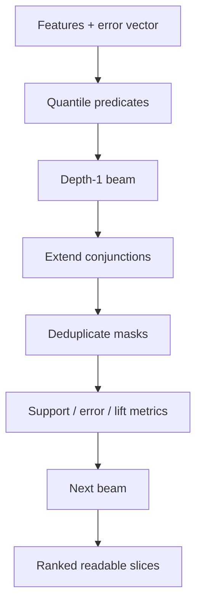

# Architecture

```mermaid
flowchart TB
    X[Features + error vector] --> P[Quantile predicates]
    P --> B1[Depth-1 beam]
    B1 --> E[Extend conjunctions]
    E --> D[Deduplicate masks]
    D --> M[Support / error / lift metrics]
    M --> B2[Next beam]
    B2 --> R[Ranked readable slices]
```

The search stores boolean masks rather than training a surrogate classifier, keeping every returned result tied to an explicit rule.
